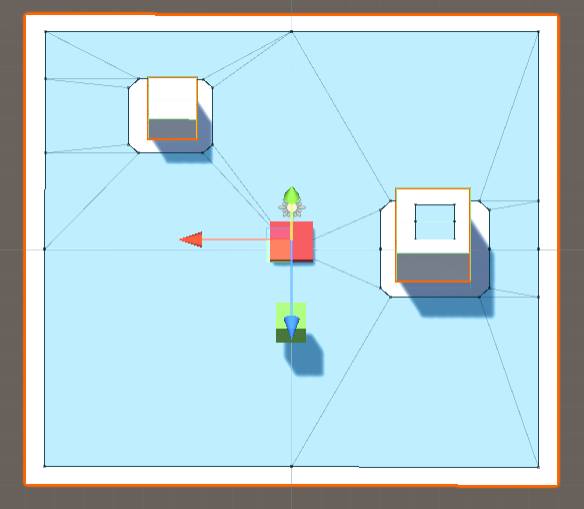
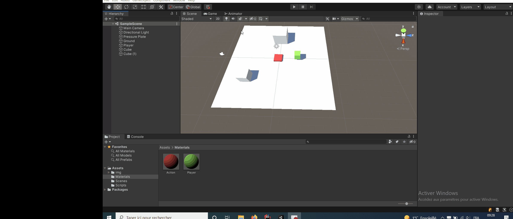

# Faisons apparaître des PNJ qui nous suivent

## Faisons apparaître un PNJ
Commençons par créer un Empty, il représentera notre Spawn. Ensuite, créons un nouveau Script.
Nous allons maintenant utiliser la fonction [Instantiate](https://docs.unity3d.com/ScriptReference/Object.Instantiate.html).
Comme vous pouvez le voir il y en a plusieurs, avec la position, la rotation, le parent, etc.
Mais elles ont toutes en commun le premier paramètre: original de type GameObject. C'est tout simplement l'objet
qui va apparaître grâce à la fonction. Les autres paramètres permettent de changer sa position, etc.

Il nous faut donc l'objet à cloner. Pour cela, rajoutez une variable membre de type GameObject. Dedans,
vous pourrez mettre un objet de la scène ou bien un prefab.

Une fois la variable rajoutée, vous pouvez tout simplement appeler le Instantiate dans le Start. Vous
pouvez alors faire spawn l'objet là ou se trouve l'empty en récupérant sa position.

**Astuce:** Si vous mettez une position, il vous demandra alors une rotation sous la forme d'un Quaternion.
Si vous voulez la rotation de base, vous pouvez la récupérer avec `Quaternion.identity`.

## Faire apparaître plusieurs PNJ
Si maintenant je vous demande de ne pas faire apparaître un mais deux PNJ.
Vous pouvez tout simplement dupliquer la ligne, et si je vous dis d'en faire apparaître 3?
Pareil. Si je vous demande d'en faire apparaître 4? ...

Vous comprenez que rapidement on va être face à un problème. On ne peut pas dupliquer des lignes de codes
à foison comme ça. Le code va être très long si vous voulez faire apparaître beaucoup de choses.
De plus, le nombre d'élément n'est pas modifiable facilement.

Heureusement, il existe ce qu'on appelle les boucles (for, while, etc.). Elles permettent d'éxécuter
le même code un certain nombre de fois.
### Boucle for
Cette boucle est très pratique quand on veuyt éxécuter quelqu'un chose un certain
nombre de fois, par exemple 10. Sa syntaxe est la suivante:
```csharp
for(int i = 0; i < 10; ++i) {
  // Code à éxécuter
}
```
Nous pouvons la découper en plusieurs parties:
- Le mot clé for suivit des paramètres entre parenthèses séparés par des `;`
    - `int i = 0` représente l'initialisation qui est éxécutée au tout début de la boucle. Ici,
      nous déclarons la variable i, mais nous pouvons déclarer la variable j par exemple.
    - `i < 10` est la condition d'arrêt, elle va s'éxécuter à chaque début d'itération.
      Si elle est fausse, alors la boucle s'arrête.
    - `++i` est éxécutée à la fin de chaque itération. Ici, nous incrémentons i, i.e. on lui ajoute
1.
- Le code à éxécuter à chaque **itération** entre accolades

Si nous reprenons le code d'exemple et qu'on affiche i à chaque itération, on obtient
(à éxécuter dans un Start):
```csharp
for(int i = 0; i < 10; ++i) {
  Debug.Log(i);
}
```
Ce qui va afficher dans la console:
```
0
1
2
...
9
```

<details>
 <summary> Pourquoi s'arrête t-on à 9? </summary>
Si vous détaillez n peu le fonctionnement de la boucle on va faire, quand i vaut 9:
- On incrémente i, donc i vaut maintenant 10
- On teste si i < 10, or ce n'est pas le cas, donc la boucle s'arrête.
On est sur une boucle exclusive car la limite n'est pas atteinte, si on veut une boucle inclusive
il suffit de remplacer la condion d'arrêt par `i <= 10` (<= signifie inférieur OU égal).
</details>

<details>
 <summary> Remarque </summary>
La boucle for n'est pas une simple boucle qui va de 0 à un nombre donné. Elle a ses
subtilités que nous aurons pas le temps de voir mais n'hésitez pas à poser des questions si ça 
vous intéresse.
</details>

### Boucle while
La boucle while possède une syntaxe beaucoup plus simple:
```
while(condition_booleenne) {
  // Code à éxécuter
}
```
Nous allons itérer tant que la condition est valide, cette condition étant évaluée au début de chaque itération.
On peut par exemple s'en servir pour générer un point aléatoire tant qu'il n'est pas dans la zone voulue.

### Faisons apparaître nos PNJ
Maintenant, vous avez toutes les clés en main pour faire apparaître plusieurs ennemis.
Pensez à rendre configurable le nombre dans l'inspector. Il serait aussi judicieux de calculer une position
différente pour chaque PNJ afin qu'ils ne se superposent pas. Pour ça vous pouvez utiliser le i.

### Faisons une grille de PNJ
Il est parfaitement possible d'imbriquer une boucle for dans une autre. C'est utilisé principalement
pour itérer en deux dimensions ou sur deux intervalles. Par exemple, si on veut faire apparaître
une grille de PNJ. La double boucle pourrait ressembler à ça:
```csharp
for(int i = 0; i < 10; ++i) {
  for(int j = 0; j < 12; ++j) {
    // Code à éxécuter
  }
}
```
Ici, nous allons pour chaque itération de la première boucle, faire une seconde boucle qui va faire
itérer j de 0 à 12.

**Attention:** Il arrive souvent sur ce genre de boucles de se tromper. Faites donc bien attention
à sur la seconde boucle à tester j et incrémenter j. Sinon gare aux boucles infinies.

<details>
 <summary> Astuce</summary>
Si vous souhaitez rendre configurable la limite pour le i et pour le j mais que vous ne voulez pas avoir
deux variables, vous pouvez utiliser le type Vector2Int. Il est configurable dans l'Inspector et vous
pouvez ensuite récupérer le x et le y en faisant respectivement `monVector.x` et `monVector.y`.
</details>

### Pour aller plus loin

#### Faire apparaître nos PNJ aléatoirement
L'idée sera ici de faire apparaître nos PNJ dans des zones aléatoires.
Vous pourrez utilisés les fonction se trouvant dans la classe
[Random](https://docs.unity3d.com/ScriptReference/Random.html). Vous pouvez
notamment utiliser la fonction Random.Range.

## Faire apparaître des PNJ toutes les x secondes
Nous allons maintenant faire en sorte de spawn des PNJ mais seulement toutes les x secondes.
Pour cela c'est très simple, il nous faut une durée qu'on rendra configurable dans l'Inspector.
Ensuite, nous pouvons compter très facilement dans le Update en accumulant le Time.deltaTime qui est
je rappelle l'intervalle entre deux images.

Une fois que nous comptons le temps, nous pouvons vérifier si le temps est écoulé. Si c'est le cas
on fait spawn notre PNJ, et on reset notre compteur.

### Pour aller plus loin

#### Spawn dans le temps aléatoire
Vous reprendrez votre spawner qui fait apparaître des PNJ dans le temps.
Vous ferez en sorte que le temps entre chaque spawn soit aléatoire.
Pour cela, vous pouvez utiliser la fonction précédemment évoquée pour
calculer le nouveau temps à chaque spawn.

## Maintenant, et si on les déplaçait
Afin de faire en sorte que nos PNJ se déplacent nous allons utiliser le PathFinding. C'est un ensemble
de technique qui permettent de trouver le meilleur chemin. Ici nous sommes sur un déplacement libre
et non pas en grille, le NavMesh semble être la meilleure option.

Un NavMesh est un mesh qui permet d'indiquer les zones où on peut se déplacer dans un environnement.
Les NavMeshAgent vont ensuite pouvoir se déplacer dessus pour rejoindre une destinations. Vous trouverez ci-dessous
un exemple de NavMesh représenté en bleu. Seul le sol et les obstacles blancs ont été pris en compte.




### Générer le NavMesh
For heureusement, Unity nous fournit tous les outils pour générer le NavMesh. Il faut tout d'abord
ouvrir la fenêtre de Navigation:
- Barre d'outils > Window > AI > Navigation

Maintenant, il faut s'assurer que nos objets sont pris en compte donc assurez vous qu'ils soient en static.
Vous pouvez aussi les sélectionner et les passer en static depuis la fenêtre (onglet Objects).

Il vous restes plus qu'à aller dans l'onglet Bake et faire Bake tout en bas.

**Remarque:** Dans l'exemple ci-dessus, le sol et les deux cubes blancs ont été passés en static.



### Suivre le joueur
Maintenant, que nous avons généré le mesh il faut dire à Unity que nos PNJ peuvent marcher dessus.
Pour cela, rajoutez un Component NavMeshAgent. Celui permet d'indiquer que l'IA doit se déplacer sur le NavMesh.

Malheureusement, si vous faîtes Play, il ne se passe rien. C'est parce qu'on a pas indiqué à notre
IA à quel endroit aller. Nous allons donc créer un Script. Celui ci devra:
- Récupérer le NavMeshAgent sur se trouvant sur l'objet
- Donner la destination (ici la position du joueur) à l'agent grâce à la variable
  [destination](https://docs.unity3d.com/ScriptReference/AI.NavMeshAgent-destination.html).

### Pour aller plus loin

#### PNJ "intelligent" qui ne fonce pas dans le joueur
Actuellement, nos PNJ vont jusqu'à notre joueur et rentre dedans.
Vous ferez en sorte que nos Agents s'arrête juste avant.

<details>
 <summary> Astuces </summary>
- Il est possible d'arrêter l'Agent gâce à la variable 
[isStopped](https://docs.unity3d.com/ScriptReference/AI.NavMeshAgent-isStopped.html).
- Vous pouvez vérifier facilement que vous rentrez en collision avec le joueur
en comparant le transform qui rentre en collision et celui du joueur.
- Il est tout à fait possible de rajouter un Collider en plus, plus grand en
mode Trigger pour détecter le joueur.
</details>