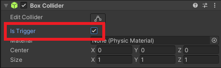
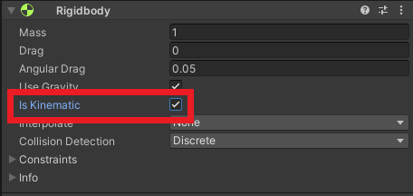
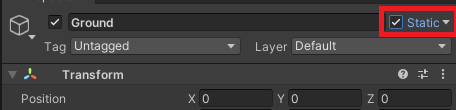
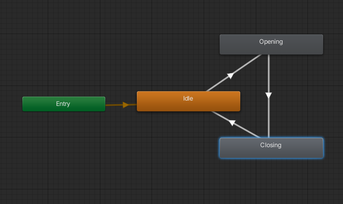

[< Accueil](README.md)

# Rendons le monde plus vivant avec une plaque de pression
Ici, nous allons rajouter un peu de vie et d'intéraction en rajoutant une plaque de pression.
Celle-ci aura pour but, dans un premier temps, de déplacer un objet. Puis, de
déplacer dans le sens inverse si le joueur sort.

Tout d'abord créons le script comme précédemment, pensez bien à lui donner un nom parlant.

## Configurons la plaque de pression
Nous allons utiliser les Trigger pour le script, il faut donc passer le collider en
mode Trigger.



Il faut aussi s'assurer que la collision est détecté, rajoutons un RigidBody sur
notre plaque. Mais attetion, il faut penser à cocher IsKinematic sur le Rigidbody pour
qu'il ne subisse pas la physique.



Puis, ajoutons notre Script dessus.

## Déplaçons une porte quand le joueur marche dessus
Détaillons notre problème, nous voulons:
- Détecter qu'un objet rentre en trigger avec nous
- Vérifier que c'est le joueur
    - Si c'est le joueur, déplacer un objet

### Détectons la présence du joueur
Comme évoqué précédemment, nous allons utiliser les Trigger et
donc les événements associés. Les événements pour les Trigger sont très similaires
à ceux de la collision. Pour détecter, un trigger en entrée, c'est:
```csharp
private void OnTriggerEnter(Collider other) {
  // ...
}
```
Contrairement au OnCollisionEnter, le OnTriggerEnter a en paramètre le collider
qui est rentré en collision avec nous. Celui, nous permet néanmoins aussi de
vérifier quel tag a l'objet en question. Cela se fait de la même façon que
pour la détection du sol mais cette fois utilisons plutôt le tag Player qu'il
faudra mettre sur le joueur. Une fois détecté nous pouvons éxécuter le code de déplacement
dans le if.

### Déplaçons l'objet en question
Si nous souhaitons déplacer un objet, il nous faut connaître:
- L'objet en question
- Le déplacement à appliquer

Afin de rendre cela configurable dans l'Inspector, vous créerez deux variables membres.
Une de type Transform (ce qui nous permettra de le déplacer), l'autre de type Vector3
(pour connaître le déplacement).

Ensuite pour déplacer l'objet c'est très simpe, nous pouvons nous inspirer du déplacement
du joueur mais attention au Transform sur lequel faire le Translate.

### Déplaçons la porte qu'une seule fois
Si vous testez bien votre plaque de pression, vous remarquerez qu'en passant
plusieurs fois dessus, la porte n'arrête pas de se déplacer.
Nous allons régler le problème assez simplement, nous allons fermer la porte si
le joueur s'en va.

Nous allons pour cela utiliser le OnTriggerExit, événement appelé quand un objet
sort du trigger. Sa signature est très semblable:
```csharp
private void OnTriggerExit(Collider other) {
  // ...
}
```
Vous pouvez ensuite éxécuter le même code que précédemment à la nuance
qu'il faut déplacer la porte dans l'autre sens. Une simple négation ou un `* -1`
suffira.

### Améliorons notre code
Comme vous l'avez compris, notre code est très (très) similaire entre les deux fonctions.
Or la répétition est source d'erreur. Imaginez, vous avez du code dupliqué et vous
devez changer quelque chose, une valeur, une fonction, etc. Il est fort probable
qu'une des occurences ne soit pas modifiée ce qui entraînera un bug.

C'est pourquoi ici nous allons encore utiliser une fonction qui va rassembler le code.
Si vous utiliser la même technique que pour le contrôleur vous allez avoir un soucis.
En effet, vous n'aurez pas accès au Collider et aucun moyen de connaître la direction.

Nous allons donc utiliser les paramètres de fonctions, comme ceci:
```csharp
private void DeplacerObjetSiJoueur(Collider collider, float direction) {
  // Code
}

// Pour l'appeler (depuis le OnTriggerEnter)
// Le ther vient du nom du collider en haut 
DeplacerObjetSiJoueur(other); 
```
La déclaration de fonction est très similaire à ce que l'on a fait précédemment.
Nous avons juste rajouter un paramètre entre les parenthèses. Les paramètres d'une
fonction sont tout simplement une liste de variables entre les parenthèses séparés
par une virgule.

### Pour aller plus loin
Vous pouvez maintenant essayer de faire une plaque de pression qui ne réagit pas
au joueur mais à des objets intéractibles. La porte ne s'ouvrirait alors que si
un certain nombre d'objets est atteint.

**Attention:** De base tous les objets seront pris en compte, y compris le sol,
l'environnement, etc. Vous aurez plusieurs solutions pour cela:
- Mettre un Component sur chaque objet intéractif et voir s'il est
  présent au moment de la collision. Pour cela, vous pouvez faire un GetComponent.
  S'il n'est pas présent la valeur retourné sera null.
- Vérifier que l'objet en question n'est pas [static](https://docs.unity3d.com/ScriptReference/GameObject-isStatic.html).
  Il faudra ensuite passer en static chaque objet de l'environnement ou chaque objet ne se déplaceant pas.
  
- Utiliser les [Layer physique](https://docs.unity3d.com/Manual/LayerBasedCollision.html) pour faire en sorte que la plaque de pression
  rentre en collision qu'avec certains objets.

## Utilisons une animation sur la porte
Nous allons maintenant faire en sorte d'avoir une animation lisse pour notre porte.

### Utilisation de l'Animator
**Rappel:** Si vous avez besoin d'un rappel sur l'utilisation des Animation et de l'Animator vous pouvez
aller voir mon [cours](https://docs.google.com/presentation/d/1vzZsRoEAxDgLO7XKrbbf5qgu3SqAh34wT6K8A4kLyB0/edit?usp=sharing).

Il nous faudra une animation d'ouverture. Vous pouvez aussi éventuellement faire une animation de fermeture.
Mais il est possible de jouer une animation à l'envers en mettant sa vitesse à -1.

Puis un Animator assez basique qui a trois état:
- Un idle qui ne fais rien
- Relié à un état d'ouverture
- Relié à un état de fermeture, relié à l'Idle



Il faudra ensuite un paramètre EstOuvert de type booléen. Celui nous permettra de
paramétrer notre Animator.

Une fois ce setup en place, nous allons pouvoir jouer l'animation.

### Changer le paramètre par Script
Changer le paramètre est très semblable à comment on a pu faire avec Bolt. Ici, il nous suffit de
faire un SetBool avec le nom et la nouvelle valeur sur l'animateur.
Attention cependant au fait que Bolt récupérait l'animator pour nous. Il nous faudra donc récupérer
l'Animator comme le RigidBody. Il nous suffit ensuite de modifier le paramètre la où on ouvrait
et fermait la porte.

**Remarque:** Le nom utilisé dans l'Animator doit être le même que celui dans le Script.

[< Accueil](README.md)