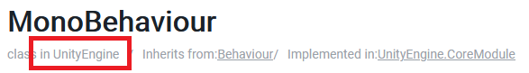

[< Accueil](README.md)

# Utilisation du C# dans Unity
## Création du Script
Pour créer un Script il existe plusieurs méthodes, mais le plus simple est de
se mettre au bon endroit dans le projet (un dossier Script par exemple), puis de faire:
- Clic Droit > Create > C# Script


Vous pouvez ensuite double cliquer dessus ce qui vous ouvrira l'IDE
par défaut (Microsoft Visual Studio).

<details>
 <summary> Remarque </summary>

 Je vous conseille d'utiliser un autre IDE tel que Visual Studio Code ou JetBrains Rider. 
J'ai personnellement une préférence pour ce dernier. Vous pouvez récupérer 
une license étudiante [ici](https://www.jetbrains.com/fr-fr/community/education/#students).

Une fois installé, il faut le lier à Unity. Pour cela, il faut aller dans les Preferences d'Unity:
- Barre d'Outil > Edit > Preferences
- Puis aller dans la catégorie External Tools
- Puis de passer le premier champ (External Script Editor) sur Rider.


</details>

## Utilisation du Script
Notre script nouvellement créé peut être ajouter sur un GameObject
pour rajouter des comportements. C'est l'équivalent d'une Flow Machine avec
un Flow Graph. Pour l'ajouter, vous avez deux possibilités:
- Drag n Drop votre Script sur l'objet
- Faire Add Component dans l'Inspector et chercher le Script


## Structure d'un Script
Une fois l'IDE ouvert, vous pourez voir le code générée par défaut:
```csharp
using UnityEngine;

public class Test : MonoBehaviour
{
    // Start is called before the first frame update
    void Start()
    {
        
    }

    // Update is called once per frame
    void Update()
    {
        
    }
}
```
Détaillons le script ensemble.

### Les **using**
```csharp
using UnityEngine;
```
Tout en haut du script, vous retrouvez les **using**.
Ils permettent d'importer le code nécessaire au fonctionnement.
Ici nous importons le code du *namespace* UnityEngine qui contient notamment
MonoBehaviour que nous verrons juste après.
Si vous utiliser une autre classe:
- Soit l'IDE vous l'importe.
- Soit vous pouvez le retrouver sur la documentation.
  Par exemple, pour le [MonoBehaviour](https://docs.unity3d.com/ScriptReference/MonoBehaviour.html):
  


### Déclaration de la classe
```csharp
public class Test : MonoBehaviour
{
    ...
}
```
Nous avons ici plusieurs partie:
- La déclaration de la classe avec son nom et son accessibilité: `public class Test`.
    - On ne rentrera pas dans les détails mais `public` signifie qu'on peut y accéder de partout.
    - `class` est tout simplement le mot clé pour désigner une classe
    - `Test` est tout simplement le nom de la classe.
        - Attention pour un MonoBehaviour ça doit être le même que le nom de fichier ! Sinon Unity ne peut pas l'utiliser
- L'héritage avec `: MonoBehaviour` qui permet de dire que notre classe **est**
  un MonoBehaviour. On ne rentrera pas dans les détails mais ça nous permet alors
  de l'utiliser sur un GameObject et d'avoir accès au Update, etc.
- Le corps de la classe `{ ... }` permet de définir le contenu de la classe,
  nous verrons plus tard que nous pouvons avoir:
    - Des variables membres (pour stocker des valeurs)
    - Des fonctions

Nous avons vu comment déclarer la classe, parlons maintenant en quoi ça consiste.
Le C# est ce qu'on appelle un langage orienté Objet, cela signifie que son
fonctionnement, son coeur est l'Objet. Un Objet est un élément qui va contenir des
variables et des fonctions que nous verrons plus tard. Ici, une classe permet de quoi un objet
est constitué. Nous ne rentrerons pas plus dans les détails à ce stade.

### Déclaration des fonctions
```csharp
   void Start()
    {
        
    }

    void Update()
    {
        
    }
```
La classe par défaut déclare deux fonctions, Start et Update qui correspondent au
noeuds d'événement Start et Update de Bolt. Pour le moment, nous n'allons pas voir ce qu'est une fonction.
Retenez juste que tout le code entre les accolades du Start
s'éxécutera au début du Jeu ou de le vie de l'objet, et que le code entre les accolades de l'Update
se fera à chaque image.


<details>
 <summary> Astuce </summary>

Si vous souhaitez envoyer du code sur discord c'est très simple.
Vous pouvez l'envoyer comme ça:
  ```csharp
  ...
  code
  ...
  ```
</details>

[< Accueil](README.md)